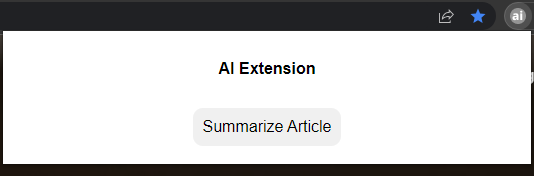

# AI Extension
AI-enabled Chrome extension

## Running Locally

1. Run `npm install`
1. Run `npm run build` this will create a `./build` directory
2. In Chrome, go to `chrome://extensions/`
3. Turn on Developer Mode
4. Click on `Load unpack` and select the `./build` directory
5. Acquire an OpenAI API key [here](https://platform.openai.com/account/api-keys)
6. Open the extension on a website with an `<article>` HTML element
7. Paste the OpenAI key into the extension
8. Click `Summarize Article`